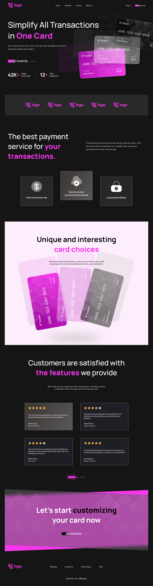

# credit-card-landing-page

### This is the Project 7 of Full Stack JavaScript Bootcamp 2.0 by iNeuron

I have used CSS properties like Flexbox, Grid, Position to build the website and used Media Queries to make the website responsive.

### Tech Stack

- HTML
- CSS

### :rocket: [Live Link](https://credit-card-webpage-dipayan.netlify.app/)

### Output

**[Desktop Preview]**

